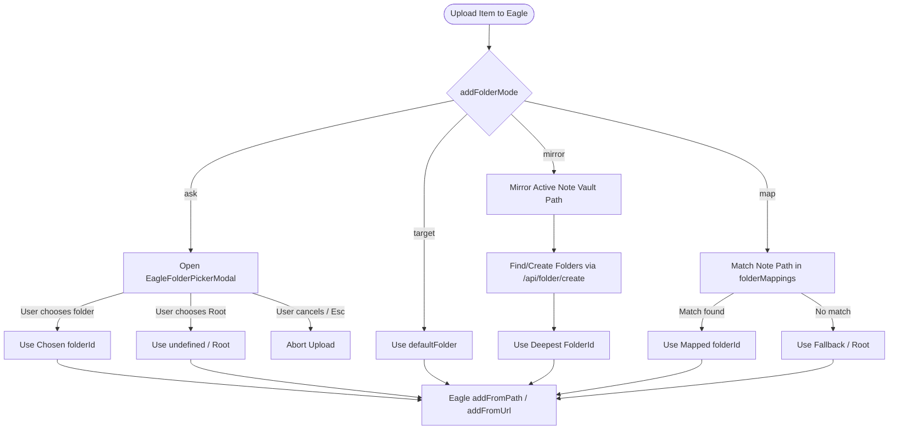

# Architecture & System Design: Target Folder 2.0

## 1. Overview
The Target Folder 2.0 system generalizes Eagle folder assignment from a single static folder into four flexible workflows:
1. **Ask**: Real-time folder picker modal before upload.
2. **Add to Target Folder**: Static designated folder.
3. **Mirror Obsidian Folder Hierarchy**: Automatic path mirroring.
4. **Use Folder Map**: Dynamic mapping rules.



---

## 2. Interactive Folder Picker ("Ask" Mode)

### UX Modeling after Eagle Chrome Extension
The folder picker mirrors the clean, efficient UX of Eagle's official Chrome extension:
- **Search Header**: Centered search bar with placeholder `Select Eagle folder...`.
- **Top Option: Library Root**:
  - `📁 Library Root (Uncategorized)`
  - Allows intentionally saving to the root without creating or assigning a folder.
- **Recent Folders Section**:
  - Appears right below the root option when search query is empty.
  - Combines Eagle's `/api/folder/listRecent` API results with recent folder selections made within Obsidian (`recentEagleFolders`).
  - Labeled with a subtle section divider: `RECENT FOLDERS`.
  - Decorated with a clock icon (`🕒`) and folder path.
- **All Folders Section**:
  - Displays all folders from `/api/folder/list` flattened into breadcrumb paths (`Parent / Child / Folder`).
  - Labeled with a subtle section divider: `ALL FOLDERS`.
- **Fuzzy Search & Filtering**:
  - As the user types, suggestions filter in real time.
  - Both folder name and ancestor path are matched.
- **Keyboard Navigation**:
  - `↑` / `↓` navigates suggestions.
  - `Enter` confirms selection.
  - `Esc` cancels the modal and safely cancels the pending upload.

---

## 3. Mirror Obsidian Folder Hierarchy

### Folder Path Resolution & Dynamic Creation
1. **Extract Vault Path**:
   - For an active note `Projects/Work/Reports/Meeting.md`, the relative vault directory is `Projects/Work/Reports`.
   - If the note is at the vault root (`""`), the folderId is `undefined` (Eagle Library Root).
2. **Path Traversal & Creation**:
   - Fetch the current Eagle folder tree via `api.listFolders()`.
   - Walk the path segments `["Projects", "Work", "Reports"]`:
     - Level 1: Find top-level folder named `"Projects"`. If not found, call `api.createFolder({ folderName: "Projects" })`.
     - Level 2: Find child folder under `"Projects"` named `"Work"`. If not found, call `api.createFolder({ folderName: "Work", parent: projectsId })`.
     - Level 3: Find child folder under `"Work"` named `"Reports"`. If not found, call `api.createFolder({ folderName: "Reports", parent: workId })`.
   - Return the ID of the leaf folder (`Reports`).
3. **Safety & Fallbacks**:
   - If Eagle folder creation fails at any step, the operation logs a warning and falls back to the nearest successfully created ancestor folder or root library.

---

## 4. Folder Map Engine

### Rule Structure & Longest Prefix Matching
Users define an array of `EagleFolderMapping`:
```typescript
interface EagleFolderMapping {
  id: string;
  obsidianFolder: string; // e.g. "Work/Clients"
  eagleFolderId: string;  // Eagle folder ID
  eagleFolderName: string;// e.g. "Clients / Active"
}
```

### Matching Algorithm:
1. Normalize active note directory path (e.g. `Work/Clients/Acme/Notes` $\rightarrow$ `Work/Clients/Acme`).
2. Exact Match: Check if any mapping has `obsidianFolder === notePath`.
3. Prefix Match: Sort remaining mappings by `obsidianFolder.length` descending. Find the first mapping where `notePath.startsWith(mapping.obsidianFolder + '/')`.
   - Example: A note in `Work/Clients/Acme` will match `Work/Clients` over `Work`.
4. Fallback: If no rule matches, return `defaultFolder || undefined`.

---

## 5. Settings Tab UI Design

### Layout & Conditional Rendering
* **Heading**: `Eagle folder settings` (replacing `Eagle target folder`).
* **Dropdown**: `When adding an item to Eagle`
  * Options:
    * `Ask`
    * `Add to Target Folder`
    * `Mirror Obsidian Folder Hierarchy`
    * `Use Folder Map`
* **Dynamic Content by Mode**:
  * **Target Folder Mode**:
    * Current folder description.
    * `Select Folder` button (opens search modal).
    * `Clear` button (resets to Root Library).
  * **Ask Mode**:
    * Explanatory text: "Prompts you with a searchable folder picker before each upload, featuring your recently used folders."
    * `Clear Recent Folders` button to reset folder history.
  * **Mirror Mode**:
    * Explanatory text: "Automatically creates and mirrors your note's folder structure in Eagle relative to the vault root."
  * **Folder Map Mode**:
    * Explanatory text: "Route attachments to specific Eagle folders based on which Obsidian folder the note belongs to."
    * Mappings Table / List:
      * Rows showing `[Obsidian Folder] ➔ [Eagle Folder]` with a Delete (`trash`) icon button.
    * `Add Mapping` Button:
      * Opens a lightweight dialog/modal to select an Obsidian vault folder and pick an Eagle folder.
